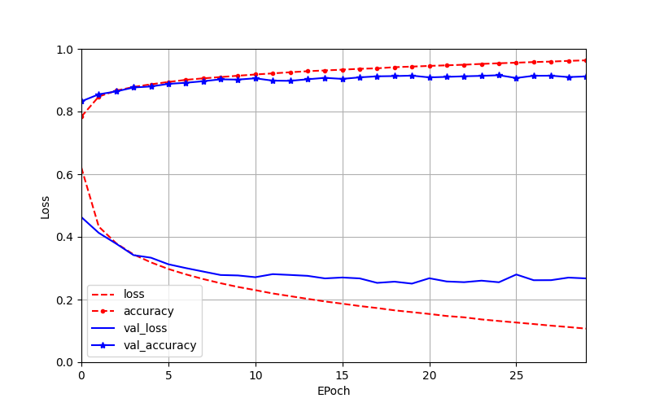

# Cloth-Classifier
โปรเจคปี 3 เทอม 1 วิชา Introduction to Data Science

จุดประสงค์ : ปรับแก้โค้ดให้โมเดลสามารถทำนายรูปเสื้อผ้าหรือเครื่องแต่งกายได้แม่นยำยิ่งขึ้น จากความแม่นยำเดิมที่ 88 เปอร์เซ็นต์

รายละเอียด : ใช้ภาษา python และ tensorflow library เป็นหลัก

- fashion_mnist_dnn.py ไฟล์โค้ดในการสร้างโมเดลเดิม (ความแม่นยำเดิมที่ 88 เปอร์เซ็นต์) โดยใช้ Neural Network
- fashion_noodlesCool.py ไฟล์โค้ดที่ถูกปรับแก้จากโมเดลเดิม โดยใช้ Neural Network

Report : [ตารางประสิทธิภาพ](https://github.com/jameVee/Cloth-Classifier/issues/1#issue-1718147106)

Demonstration Video : https://youtu.be/VvHIwbfODm0
